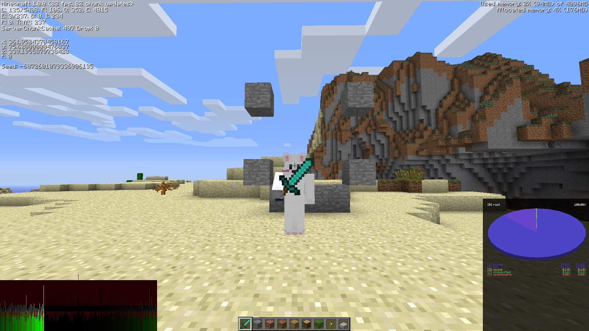

# Minecraft Intel Graphics Fixer (1.0 - 1.7.10)

A lightweight, standalone tool to fix the notorious "inventory rendering" bug on modern Intel Graphics drivers.

## Credits
*   Huge thanks to **TheMasterCaver** on the Minecraft forums for identifying the root cause of the Intel OpenGL driver bug.
  
## The Problem
If you try to play Minecraft versions **Release 1.0 through 1.7.10** on Intel Graphics, the game often:
*   "Corrupts" textures immediately when opening the inventory.
*   Shows a blank/solid colored screen when holding items.
*   Flickers uncontrollably.

## The Solution
This tool patches your **Vanilla** Minecraft jar files to fix the OpenGL context issue (`glActiveTexture` vs `glClientActiveTexture` desync).
*   **No mods required:** You don't need Forge, Fabric, or Prism Launcher.
*   **Vanilla compatible:** Works with the Official Minecraft Launcher and SKLauncher. Though I'm sure Prism/MultiMC has an "Add to Minecraft.jar" option.
*   **Tiny:** The entire patcher is <100KB.

## How to Use
1.  **Download** the latest `.zip`.
2.  **Extract** the folder.
3.  Double-click `intel-fix.bat` (Windows).
4.  **Select the version** you want to fix (e.g., `1.7.10`).
    *   *Note: You must have launched the Vanilla version at least once so the jar exists.*
5.  The tool will create a new version in your launcher called (e.g. `1.7.10-fixed`).
6.  **Play!** Select the custom version in your launcher.

<h2>Comparison</h2>

<!-- 1.0 Comparison -->
<table>
  <tr>
    <th width="50%">Before</th>
    <th width="50%">After</th>
  </tr>
  <tr>
    <td>
       
       
<i>Rendering broken</i>

    </td>
    <td>
       
       
<b>Tested on Release 1.0 (SKLauncher)</b>

    </td>
  </tr>
</table>

## Supported Versions
*   Release 1.0
*   Release 1.1
*   Release 1.2.5
*   Release 1.3.2
*   Release 1.4.7
*   Release 1.5.2
*   Release 1.6.4
*   Release 1.7.10
*   *(And more, if you kindly ask)*
